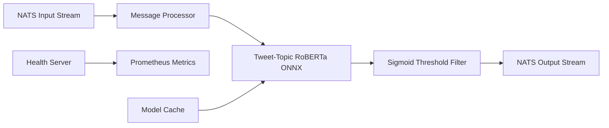

# NATS Stream Processor - Topics

A high-performance Python microservice for processing Bluesky posts with multi-label topic classification using ONNX Runtime for fast CPU inference. This service subscribes to NATS JetStream, classifies posts into 19 tweet-specific topic categories using a RoBERTa model trained on Twitter data, and publishes enriched data for real-time dashboards and analytics.

## 🚀 Quickstart

### Local Development (Docker)

```bash
# Start NATS and stream processor with docker compose watch for live reloading
# Uses .env.local for local development configuration
docker compose watch
```

### Local Development (Python)

```bash
# uv is the recommended way to install dependencies
curl -LsSf https://astral.sh/uv/install.sh | sh

# Install dependencies and run
uv sync --frozen
source .venv/bin/activate
python main.py
```

### Kubernetes Deployment

```bash
# Clone the repository (if not already cloned)
git clone https://github.com/richardr1126/nats-stream-processor-topics.git
cd nats-stream-processor-topics

# Configure environment variables
cp charts/.env.example charts/.env
# Edit charts/.env with your NATS configuration
# Note: Production uses 'bluesky-posts' stream, local development uses 'bluesky-posts-dev'

# Deploy to Kubernetes
cd charts
./create-secrets.sh
helm install nats-stream-processor-topics ./nats-stream-processor-topics
```

## 🚀 Features

- **Real-time Stream Processing**: Consumes posts from NATS JetStream with backpressure handling
- **Fast CPU Topic Classification**: Tweet-specific RoBERTa ONNX model optimized for multi-label topic classification
- **Individual Message Processing**: Processes each post individually for low-latency topic classification
- **Multi-Label Classification**: Assigns multiple relevant topics to each post with sigmoid scores
- **19 Tweet Topic Categories**: Trained specifically on Twitter data for social media content classification
- **Production Ready**: Health checks, Prometheus metrics, structured logging, and Kubernetes deployment
- **Sigmoid Threshold Filtering**: Only publishes topics above configurable sigmoid threshold (default 0.5)
- **Containerized**: Docker image with model caching and ONNX optimization
- **Observable**: Comprehensive metrics for processing rate, topic distribution, and performance
- **Scalable**: Horizontal scaling with JetStream durable consumers and queue groups

## ⚙️ Configuration

Configure the service using environment variables:

### NATS Settings
- `NATS_URL`: NATS server URL (default: `nats://nats.nats.svc.cluster.local:4222`)
- `INPUT_STREAM`: Input JetStream stream name (default: `bluesky-posts`)
- `OUTPUT_STREAM`: Output JetStream stream name (default: `bluesky-posts-topics`)
- `INPUT_SUBJECT`: Input subject pattern (default: `bluesky.posts`)
- `OUTPUT_SUBJECT`: Output subject prefix (default: `bluesky.topics`)
- `CONSUMER_NAME`: JetStream consumer name (default: `topic-processor`)
- `QUEUE_GROUP`: Queue group name used for load-balanced consumption across replicas (default: same as `CONSUMER_NAME`)
- `NUM_STREAM_REPLICAS`: Number of stream replicas for high availability (default: `1`)

### Processing / Consumer Settings
- `ACK_WAIT_SECONDS`: JetStream ack wait before redelivery (default: `30`)
- `MAX_DELIVER`: Max delivery attempts before JetStream stops redelivering (default: `3`)
- `MAX_ACK_PENDING`: Max unacked messages in-flight per consumer - lower this to prevent resource contention during catch-up (default: `100`)
- `MAX_RETRIES`: Maximum retry attempts for publish operations (default: `3`)
- `RETRY_DELAY`: Delay between retries in seconds (default: `1.0`)
- `DUPLICATE_WINDOW_SECONDS`: Output stream de-duplication window in seconds (default: `600` = 10 minutes)

### Topic Classification Model Settings
- `MODEL_NAME`: HuggingFace model name (default: `richardr1126/tweet-topic-21-multi-ONNX`)
- `MODEL_CACHE_DIR`: Local model cache directory (default: `./models`)
- `MAX_SEQUENCE_LENGTH`: Maximum text sequence length (default: `512`)
- `SIGMOID_THRESHOLD`: Minimum sigmoid score to include a topic label (default: `0.5`)

**Note**: The model has 19 predefined topic categories trained on Twitter data. Topic labels are built into the model and cannot be customized.

### Monitoring Settings
- `HEALTH_CHECK_PORT`: Health check server port (default: `8080`)
- `METRICS_ENABLED`: Enable Prometheus metrics (default: `true`)
- `LOG_LEVEL`: Logging level (default: `INFO`)
- `LOG_FORMAT`: Log format - `json` or `console` (default: `console`)
- `SERVICE_NAME`: Service name for logging and metrics (default: `nats-stream-processor-topics`)

## 🏗 Architecture



### Processing Pipeline

1. **Message Consumption**: JetStream consumer with manual acknowledgment
2. **Text Preprocessing**: Tokenization for RoBERTa text classification
3. **ONNX Inference**: Fast CPU-optimized multi-label topic classification (19 topics)
4. **Sigmoid Threshold Filtering**: Only include topics with sigmoid scores >= threshold
5. **Result Publishing**: Enriched posts with topic data to output stream

### Message Format

**Input Message** (from nats-firehose-ingest):
```json
{
  "uri": "at://did:plc:abc123/app.bsky.feed.post/xyz789",
  "cid": "bafyrei...",
  "author": "user.bsky.social",
  "text": "Just deployed my new web app built with React and Node.js!"
}
```

**Output Message** (enriched with topics):
```json
{
  "uri": "at://did:plc:abc123/app.bsky.feed.post/xyz789",
  "cid": "bafyrei...",
  "author": "user.bsky.social",
  "text": "Just deployed my new web app built with React and Node.js!",
  "topics": {
    "topics": ["science_&_technology", "business_&_entrepreneurs"],
    "probabilities": {
      "arts_&_culture": 0.12,
      "business_&_entrepreneurs": 0.58,
      "celebrity_&_pop_culture": 0.08,
      "diaries_&_daily_life": 0.35,
      "family": 0.05,
      "fashion_&_style": 0.03,
      "film_tv_&_video": 0.06,
      "fitness_&_health": 0.04,
      "food_&_dining": 0.02,
      "gaming": 0.15,
      "learning_&_educational": 0.22,
      "music": 0.04,
      "news_&_social_concern": 0.09,
      "other_hobbies": 0.11,
      "relationships": 0.03,
      "science_&_technology": 0.87,
      "sports": 0.02,
      "travel_&_adventure": 0.05,
      "youth_&_student_life": 0.18
    },
    "top_topic": "science_&_technology",
    "top_confidence": 0.87
  },
  "processed_at": 1698765432.123,
  "processor": "nats-stream-processor-topics"
}
```

## 📊 Monitoring

### Health Endpoints

- `GET /health` - Basic health check
- `GET /ready` - Kubernetes readiness probe (checks NATS connection)
- `GET /metrics` - Prometheus metrics

### Key Metrics

- `stream_processor_posts_processed_total` - Total posts processed
- `stream_processor_posts_published_total` - Posts successfully published with topics
- `stream_processor_topic_predictions_total{topic}` - Predictions by topic category
- `stream_processor_topic_confidence` - Histogram of confidence scores
- `stream_processor_processing_duration_seconds` - Individual post processing time
- `stream_processor_model_inference_duration_seconds` - Model inference time
- `stream_processor_message_queue_size` - Current message queue size
- `stream_processor_nats_connected` - NATS connection status
- `stream_processor_errors_total{error_type}` - Total processing errors by type

### Example Metrics

```
# HELP stream_processor_topic_predictions_total Total topic predictions made
# TYPE stream_processor_topic_predictions_total counter
stream_processor_topic_predictions_total{topic="science_&_technology"} 2547
stream_processor_topic_predictions_total{topic="news_&_social_concern"} 1823
stream_processor_topic_predictions_total{topic="diaries_&_daily_life"} 1456
stream_processor_topic_predictions_total{topic="sports"} 982
stream_processor_topic_predictions_total{topic="business_&_entrepreneurs"} 756

# HELP stream_processor_processing_duration_seconds Time taken to process individual posts
# TYPE stream_processor_processing_duration_seconds histogram
stream_processor_processing_duration_seconds_bucket{le="0.05"} 45
stream_processor_processing_duration_seconds_bucket{le="0.1"} 123

# HELP stream_processor_nats_connected NATS connection status
# TYPE stream_processor_nats_connected gauge
stream_processor_nats_connected 1

# HELP stream_processor_errors_total Total processing errors
# TYPE stream_processor_errors_total counter
stream_processor_errors_total{error_type="model_init"} 0
stream_processor_errors_total{error_type="single_analysis"} 2
```

## 🔧 Development

### Project Structure

```
nats-stream-processor-topics/
├── src/
│   ├── config.py           # Configuration management
│   ├── topic_classifier.py # Zero-shot RoBERTa ONNX topic classifier
│   ├── nats_client.py      # JetStream consumer/producer
│   ├── service.py          # Main service orchestration
│   ├── health.py           # Health check endpoints
│   ├── metrics.py          # Prometheus metrics
│   ├── logging_setup.py    # Structured logging
│   └── types.py            # Type definitions
├── charts/                 # Helm charts for Kubernetes deployment
├── main.py                 # Entry point
├── Dockerfile              # Container build
├── docker-compose.yml      # Local development setup
├── pyproject.toml          # Dependencies (uv)
└── README.md              # This file
```

### Topic Classification Model Details

The service uses the **tweet-topic-21-multi** model, a RoBERTa-based classifier fine-tuned on Twitter data with ONNX optimization:

- **Model**: `richardr1126/tweet-topic-21-multi-ONNX` on HuggingFace
- **Base Model**: `cardiffnlp/tweet-topic-21-multi` - RoBERTa trained on 124M tweets (Jan 2018 - Dec 2021)
- **Training**: Fine-tuned for multi-label topic classification on 11,267 labeled tweets
- **Runtime**: ONNX Runtime with CPU optimizations
- **Performance**: ~50-150ms inference per post (multi-label classification across 19 topics)
- **Memory**: ~1GB including model weights
- **Method**: Direct multi-label text classification with sigmoid activation
- **Advantage**: Trained specifically on social media content for accurate topic detection
- **Reference**: [Twitter Topic Classification (COLING 2022)](https://aclanthology.org/2022.coling-1.299/)

### Topic Categories

The model classifies posts into these 19 predefined topic categories:

1. **arts_&_culture** - Visual arts, design, creativity, museums
2. **business_&_entrepreneurs** - Business news, startups, entrepreneurship
3. **celebrity_&_pop_culture** - Celebrities, pop culture, entertainment news
4. **diaries_&_daily_life** - Personal updates, daily activities, life events
5. **family** - Family life, parenting, children
6. **fashion_&_style** - Fashion, clothing, style, beauty
7. **film_tv_&_video** - Movies, TV shows, streaming content
8. **fitness_&_health** - Health, fitness, wellness, exercise
9. **food_&_dining** - Cooking, restaurants, recipes, food culture
10. **gaming** - Video games, esports, gaming culture
11. **learning_&_educational** - Education, learning, academic topics
12. **music** - Musicians, concerts, songs, music industry
13. **news_&_social_concern** - News, politics, social issues, current events
14. **other_hobbies** - Hobbies and interests not covered by other categories
15. **relationships** - Dating, romance, relationships
16. **science_&_technology** - Science, technology, research, innovation
17. **sports** - Sports events, teams, athletes
18. **travel_&_adventure** - Tourism, destinations, adventures, exploration
19. **youth_&_student_life** - Student life, youth culture, education

**Note**: Topic categories are fixed by the pre-trained model and cannot be customized.

### Testing the Pipeline

1. **Start the full stack**:
   ```bash
   # For local development with mock data
   docker-compose up -d
   
   # For live development with auto-reload
   docker-compose watch
   ```

2. **Monitor processing**:
   ```bash
   # View topic processor logs
   docker-compose logs -f nats-stream-processor-topics
   
   # Check metrics
   curl http://localhost:8080/metrics
   
   # View topic distribution
   curl http://localhost:8080/metrics | grep stream_processor_topic_predictions_total
   ```

3. **Inspect streams**:
   ```bash
   # Access NATS box
   docker-compose run --rm nats-box
   
   # List streams
   nats stream list
   
   # View messages in input stream (development uses -dev suffix)
   nats stream view bluesky-posts-dev
   
   # View messages in output stream (development)
   nats stream view bluesky-posts-topics-dev
   ```

### Performance Tuning

- **CPU Threads**: Adjust ONNX runtime threads in `topic_classifier.py`
- **Sigmoid Threshold**: Lower `SIGMOID_THRESHOLD` (default 0.5) to include more topics per post, or raise it for higher precision
- **Memory**: Model uses ~800MB, total container ~1GB recommended
- **Ack Wait**: Increase `ACK_WAIT_SECONDS` if topic classification can exceed current ack wait during warm-up
- **Max Ack Pending**: Lower `MAX_ACK_PENDING` (e.g., 50-100) to prevent too many concurrent messages during catch-up

## 🚢 Deployment to GKE

The service can be deployed using Helm charts or by building custom Kubernetes manifests.

1. **Ensure prerequisites**:
   ```bash
   # Check NATS is running
   kubectl get pods -n nats
   
   # Verify input stream exists
   kubectl exec -it deployment/nats-box -n nats -- nats stream list
   ```

2. **Build and push container image**:
   ```bash
   # Build and tag image
   docker build -t gcr.io/your-project/nats-stream-processor-topics:latest .
   
   # Push to registry
   docker push gcr.io/your-project/nats-stream-processor-topics:latest
   ```

3. **Deploy the service** (create your own Kubernetes manifests or Helm chart):
   ```bash
   # Example deployment
   kubectl apply -f k8s-deployment.yaml
   ```

4. **Monitor deployment**:
   ```bash
   # Check pod status
   kubectl get pods -l app=nats-stream-processor-topics
   
   # View logs
   kubectl logs -f deployment/nats-stream-processor-topics
   
   # Check health
   kubectl port-forward svc/nats-stream-processor-topics 8080:8080
   curl http://localhost:8080/health
   ```

## 🎯 Performance Characteristics

- **Throughput**: 10-50 posts/second per replica
- **Latency**: 50-150ms processing time per post (multi-label classification across 19 topics)
- **Memory**: 1GB typical usage, 1.5GB limit recommended
- **CPU**: 300-700m typical usage, 1500m limit recommended
- **Model Load Time**: ~10-20 seconds on first startup (includes ONNX model loading)

## 🔍 Troubleshooting

### Common Issues

1. **Model Download Fails**:
   ```bash
   # Check internet connectivity and HuggingFace access
   docker-compose run --rm nats-stream-processor-topics python -c "from transformers import AutoTokenizer; AutoTokenizer.from_pretrained('richardr1126/tweet-topic-21-multi-ONNX')"
   ```

2. **No Input Messages**:
   ```bash
   # Check if input stream exists and has messages
   # For local development
   kubectl exec -it deployment/nats-box -- nats stream info bluesky-posts-dev
   # For production
   kubectl exec -it deployment/nats-box -n nats -- nats stream info bluesky-posts
   ```

3. **High Processing Time**:
   - Check CPU limits and model performance
   - Monitor inference duration metrics
   - Verify `ACK_WAIT_SECONDS` and `MAX_DELIVER` settings

4. **Low Topic Results**:
   - Check `SIGMOID_THRESHOLD` setting (default: 0.5)
   - Lower threshold to include more topics (e.g., 0.3-0.4)
   - Verify input text quality and length
   - Monitor confidence histogram metrics
   - Note: Model is trained on Twitter data and works best with social media-style content

5. **Connection Issues**:
   - Verify NATS_URL configuration
   - Check network connectivity between services
   - Monitor `stream_processor_nats_connected` metric

### Debugging Commands

```bash
# View detailed logs
kubectl logs deployment/nats-stream-processor-topics | jq 'select(.level=="debug")'

# Check consumer lag
kubectl exec -it deployment/nats-box -n nats -- nats consumer info bluesky-posts topic-processor

# For local development
docker-compose exec nats-box nats consumer info bluesky-posts-dev topic-processor-dev

# Monitor metrics
kubectl port-forward svc/nats-stream-processor-topics 8080:8080 &
watch -n 1 'curl -s http://localhost:8080/metrics | grep stream_processor'

# Check stream status
kubectl exec -it deployment/nats-box -n nats -- nats stream info bluesky-posts

# Test model loading
docker-compose run --rm nats-stream-processor-topics python -c "
import asyncio
from src.topic_classifier import topic_classifier
async def test():
    await topic_classifier.initialize()
    result = await topic_classifier.classify_topics('Just deployed my new web app! Excited to share it with everyone.')
    print(result)
asyncio.run(test())
"
```

## 🤝 Integration

This service integrates with:

- **Upstream**: `nats-firehose-ingest` (provides input posts)
- **Downstream**: Real-time dashboard, analytics services, data warehouses
- **Monitoring**: Prometheus, Grafana dashboards
- **Infrastructure**: GKE, NATS JetStream, Kubernetes

## 📈 Scaling

- **Horizontal (recommended)**: Run multiple replicas using the same durable consumer (`CONSUMER_NAME`) and a shared queue group (`QUEUE_GROUP`). The service will bind to the durable and use queue semantics so each message is delivered to only one replica.
- **Vertical**: Increase CPU/memory limits for higher throughput
- **Model**: Consider GPU deployment for very high throughput (requires CUDA ONNX provider)
- **Threshold Tuning**: Adjust `SIGMOID_THRESHOLD` to balance precision vs. recall

### Multi-pod setup with JetStream durables and queue groups

This service is configured to safely scale horizontally without consumer name conflicts by using a single durable consumer and a shared queue group:

1. All pods use the same `CONSUMER_NAME` (durable) and the same `QUEUE_GROUP`.
2. On startup, each pod attempts to bind to the durable; if it doesn't exist yet, one pod will create it.
3. Messages are delivered once to the queue group, and N pods share the work.

To verify the consumer setup:

```bash
kubectl exec -it deployment/nats-box -n nats -- nats consumer info bluesky-posts topic-processor
```

## 🤝 Contributing

1. Fork the repository
2. Create a feature branch
3. Add tests for new functionality
4. Ensure all tests pass and metrics work
5. Submit a pull request

## 📄 License

This project is part of a class assignment for datacenter computing.
